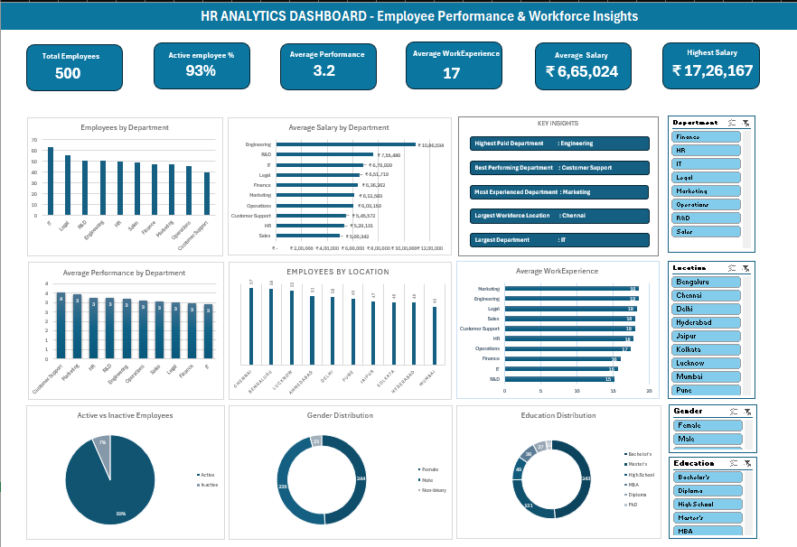

# 📊 HR Analytics Dashboard – Employee Performance & Workforce Insights

### Excel Data Analytics • Workforce Analytics • HR Insights

An interactive **Excel HR Analytics Dashboard** designed to analyze employee performance, workforce composition, compensation, experience, and employee activity.

## 📌 Project Overview

This project provides a consolidated view of workforce data to help understand employee performance, salary patterns, workforce distribution, and employee activity.

The dashboard uses **Excel KPIs, charts, slicers, and interactive analysis** to transform HR data into meaningful insights.

## 🎯 Project Objectives

* Analyze workforce composition
* Evaluate employee performance
* Analyze salary and compensation
* Compare departments
* Analyze employee experience
* Understand employee activity
* Identify workforce patterns and trends

## 🛠️ Tools Used

* Microsoft Excel
* Excel Formulas
* Pivot Tables
* Pivot Charts
* Slicers
* Data Cleaning
* Data Analysis
* Dashboard Design

## 📊 Key KPIs

* **Total Employees**
* **Active Employee %**
* **Average Performance**
* **Average Work Experience**
* **Average Salary**
* **Highest Salary**

## 📈 Dashboard Analysis

The dashboard includes:

* Employee by Department
* Average Salary by Department
* Average Performance by Department
* Average Work Experience
* Employees by Location
* Active vs Inactive Employees
* Gender Distribution
* Education Distribution
* Key Insights

## 🎛️ Interactive Filters

The dashboard includes slicers for:

* Department
* Location
* Gender
* Education

These filters allow users to interactively explore different workforce segments.

## 🖥️ Dashboard Preview

## 📂 Project File

📊 **Excel Dashboard** — [Download the Excel Dashboard](./HR%20ANALYTICS%20DASHBOARD%20-%20Employee%20Performance%20%5E0%20Workforce%20Insights.xlsx)

## 💡 Key Insights

The dashboard helps identify:

* Department-level workforce distribution
* Salary differences across departments
* Employee performance patterns
* Workforce experience levels
* Active and inactive employee distribution
* Location-based workforce patterns
* Gender and education distribution

## ⭐ Skills Demonstrated

**Excel • Data Cleaning • Pivot Tables • Pivot Charts • Slicers • HR Analytics • Workforce Analytics • Employee Performance Analysis • Compensation Analysis • Dashboard Design • Data Visualization**

Aspiring Data Analyst | Power BI | SQL | Excel
